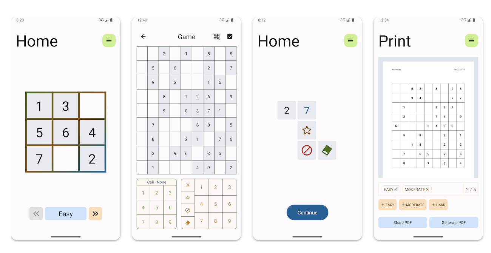
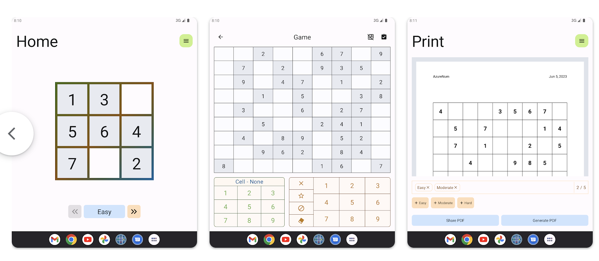
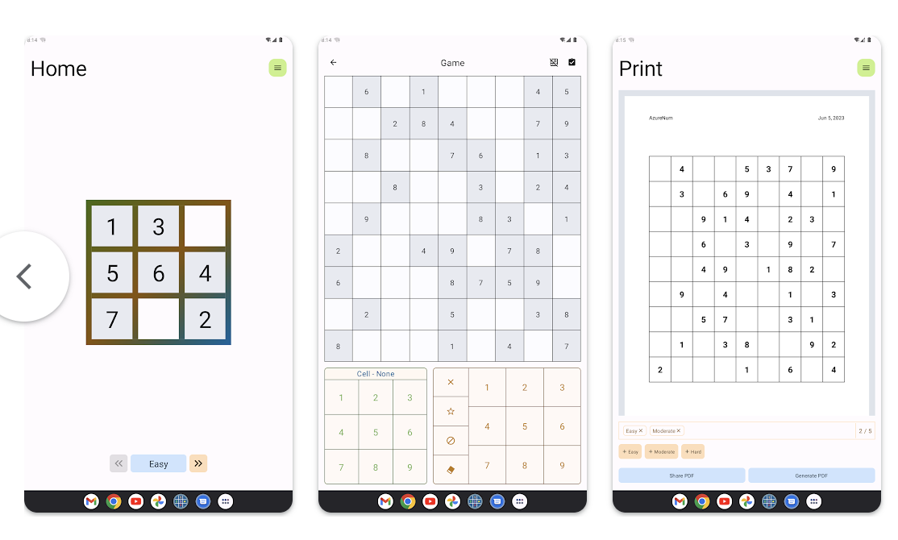

# 蔚蓝数独

蔚蓝数独是一款极简设计的数独游戏。它提供简洁和清新的数独游戏体验，同时允许你创建数独的PDF文档（能够分享和打印）。

[Google Play](https://play.google.com/store/apps/details?id=com.peter.azure)

## 特性

* 笔记功能 (给数字做标记，帮助你完成游戏)
* 自动保存 (无需担心忘记保存游戏)
* 数独PDF文档 (你可以拿公司的A4打印来玩)
* 提供教程 (让你学会如何玩数独)
* 支持多种屏幕尺寸
* 不收集用户数据
* 无需网络，即可运行

## 截图

* 手机

* 折叠手机

* 平板

## 证书

* 蔚蓝数独是在 Apache License (Version 2.0) 的条款下授权，详情请查看 [license](LICENSE)
